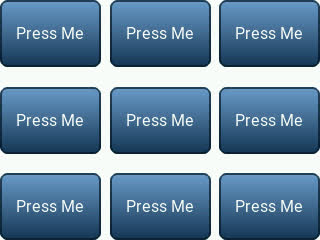
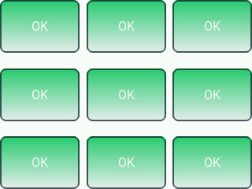

# Omega2-Dash-Test-Program
Test program for Omega2 Dash manufacturing. The test program is based on our [LVGL quickstart template](https://github.com/OnionIoT/lv_example) for the Omega2 Dash.

# How to Use the Omega2 Dash Test Program

The test program is intended to be run after Omega2 Dash manufacturing. To speed up the process, the test program will be run on Omega2 Dash units using the Omega2 platform's [USB autorun](https://onion.io/usb-autorun/).

## Prepare the USB Drive

Copy the following files from this repo to the top level directory on a USB drive:

* `auth.txt`
* `autorun.sh`
* `o2dash-test`

## Testing Procedure 

Plug in the USB drive to an Omega2 Dash.

*Optional* Observe the following message printed on the terminal:

```

Running Omega2 Dash Test Program!

```

The Omega2 Dash will then show the following on the display:



> This confirms the display works correctly

The tester shall press **all 5 buttons** to test the touchscreen works correctly. The expected end result:



> This confirms the touch input works correctly

The Omega2 Dash unit has now passed testing. Remove the USB drive and move on to the next unit.

# Potential Future Improvements to Test Program

* [ ] make buttons smaller
* [ ] add "PASS" screen when all 5 buttons are pressed
* [ ] set background to a colorful test image
